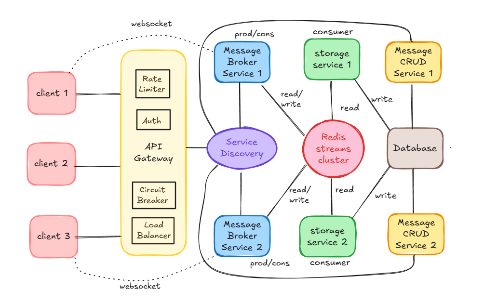
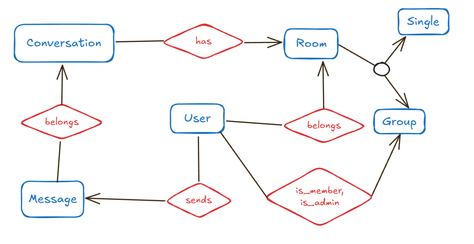
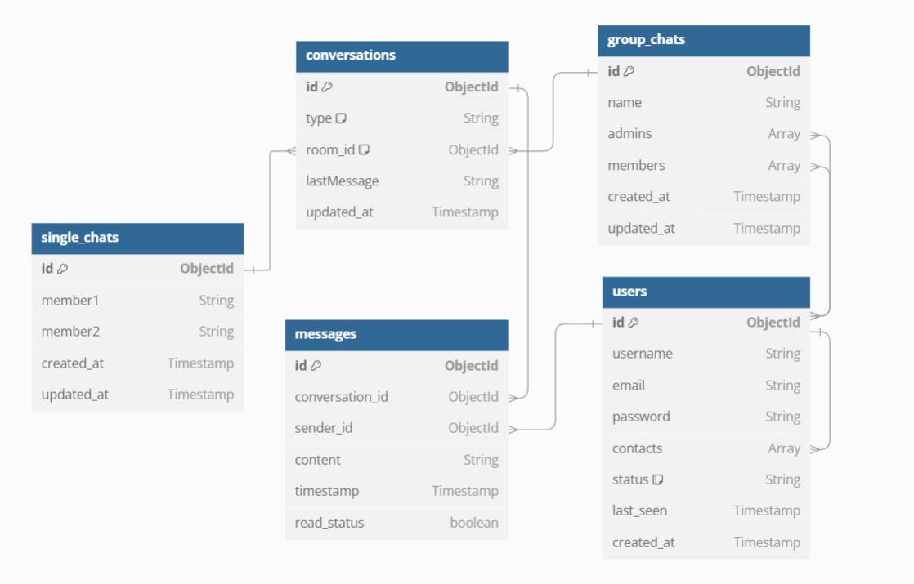

# ChatStream: Distributed WebSocket Messaging System with Redis Streams

## Overview
ChatStream is a scalable, distributed messaging system designed to handle real-time communication between multiple clients using WebSockets. It is built on a microservices architecture leveraging Redis Streams for high-throughput message processing and eventual persistence to a database. The architecture ensures scalability, fault tolerance, and efficient message delivery using message brokers, stream consumers, and dedicated CRUD services.

### Architecture


#### Architecture Components
1. Clients
   - Multiple clients (e.g., browsers or mobile apps) connect via WebSocket.
   - Communication is routed through an API Gateway.

2. API Gateway
   - Rate Limiting
   - Authentication & Authorization
   - Circuit Breaking
   - Load Balancing
   - Routes requests to appropriate services via service discovery.

3. Message Broker Services
   - Message Broker Service 1 & 2 handle WebSocket connections from clients.
   - They act as both producers and consumers for the Redis Streams cluster.
   - Broadcasts messages to other clients or services as needed.
   - A job runs in background where messages from streams are written to database after a condition is satisfied. (time interval or stream size)
4. Redis Streams Cluster
   - Acts as the central message bus.
   - Supports both read and write operations.
   - Messages are streamed to consumers (storage services).

5. Storage Services
   - Storage Service 1 & 2 consume messages from Redis Streams.
   - Responsible for processing and transforming messages for persistence.
   - Write processed data to the main database.

6. Message CRUD Services
   - Message CRUD Service expose RESTful APIs to interact with persisted messages.
   - Support operations like create, read, update, and delete.
   - Read from and write to the shared database.

7. Service Discovery
   - Enables dynamic service registration and lookup.
   - Helps the gateway and other services route traffic correctly.

### ER Diagram


### Database Schema Diagram


## Technologies Used
- Spring Boot (Reactive) – for microservices

- WebSocket – for real-time bi-directional communication

- Redis Streams – for high-performance message streaming

- MongoDB – as the persistent NOSQL storage backend

- Eureka – for service discovery

- Spring Cloud Gateway – as the API Gateway
  
## Key Features

- Scalable message broker services

- Decoupled stream processing and storage

- Real-time communication via WebSocket

- Centralized message queue using Redis Streams

- RESTful APIs for managing stored messages

- Fault-tolerant and load-balanced architecture

## Setup Instructions

1. Clone the repo
```
git clone https://github.com/edgarAndrew/ChatStream.git
```
2. Run mongodb and redis
```
cd ChatStream
docker-compose up
```
3. Start eureka server
```
cd ChatStream/serviceDicovery
./gradlew.bat bootRun
```
4. Start gateway
```
cd ChatStream/apiGateway
./gradlew.bat bootRun
```
5. Start services
```
cd ChatStream/core
./gradlew.bat startMessageBroker
./gradlew.bat startMessageCRUDService
./gradlew.bat startStorageService
```